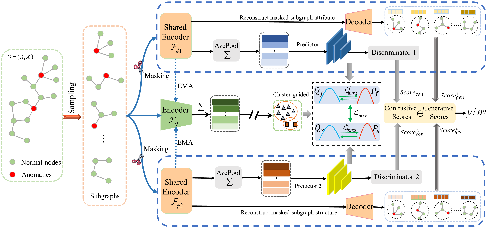

# DualGAD: Dual-bootstrapped Self-Supervised Learning for Graph Anomaly Detection




This code requires the following:
* python
* pyTorch
* numpy
* scipy
* scikit-learn
* networkx
* faiss-gpu
* torch-geometric
* dgl

This step is to run the DualGAD framework to detect anomalies in the network datasets. Take FinV dataset as an example:
```
python train.py --dataset FinV
```
